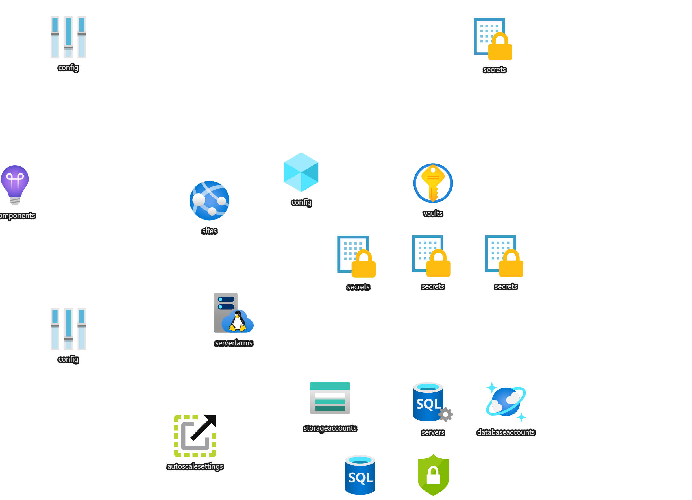

# Where's my Stuff? Azure Web App with SQL Azure, Cosmos and Azure Storage

This is a demo architecture that uses Azure Web App Services with SQL Azure, CosmosDB and Azure Storage.

### References
- [Storage Connection Strings (azDocs)](https://docs.microsoft.com/en-us/azure/storage/common/storage-configure-connection-string)
- [Add Secrets to KeyVault in ARM (blog)](https://blog.hompus.nl/2017/03/20/add-secrets-to-your-azure-key-vault-using-arm-templates)
- [Azure KeyVault Quickstart (azDocs)](https://docs.microsoft.com/en-us/azure/key-vault/secrets/quick-create-template?tabs=CLI)
- [Only update keyvault if secret changed (stackOverflow)](https://stackoverflow.com/questions/58823588/how-to-update-a-secret-in-azure-key-vault-only-if-changed-in-arm-templates-or-ch)
- [KeyVault references from App Service and Functions (azDocs)](https://docs.microsoft.com/en-us/azure/app-service/app-service-key-vault-references)

Deck and Demo are below
 

